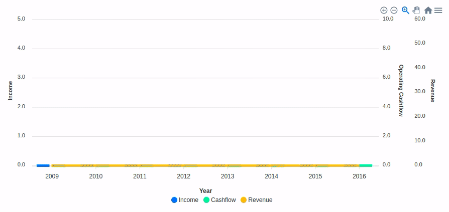

### Cartesian Charts: Part 3

#### Mixed Charts

You can mix charts by using `mixed_charts` or `combo_charts` methods.
For example, given that:
```ruby
@total_properties = Property.group_by_week(:created_at).count
```
and
```erb
<% total_series = {
  name: "Total", data: @total_properties
} %>
```
you can do this:
```erb
<%= combo_charts({**options, theme: 'palette4', stacked: false, data_labels: false}) do %>
  <% line_chart(total_series) %>
  <% area_chart(series.last) %>
  <% column_chart(series.first) %>
<% end %>
```


#### Syncing Charts

You can synchronize charts by using `syncing_charts` or `synchronized_charts` methods. For
example:
```erb
<%= syncing_charts(chart: {toolbar: false}, height: 250, style: 'display: inline-block; width: 32%;') do %>
  <% mixed_charts(theme: 'palette4', data_labels: false) do %>
    <% line_chart({name: "Total", data: @total_properties}) %>
    <% area_chart({name: "Active", data: @active_properties}) %>
  <% end %>
  <% area_chart({name: "Active", data: @active_properties}, theme: 'palette6') %>
  <% line_chart({name: "Inactive", data: @active_properties}, theme: 'palette8') %>
<% end %>
```


#### Brush Chart

```erb
<%= area_chart(total_series, {
  **options, chart_id: 'the-chart', xtitle: nil, theme: 'palette2'
}) %>
<%= mixed_charts(brush_target: 'the-chart', theme: 'palette7') do %>
  <% column_chart(series.first) %>
  <% line_chart(series.last) %>
<% end %>
```


#### Annotations

All cartesian charts can have annotations, for example:

```erb
<%= area_chart(series, {**options, theme: 'palette9'}) do %>
  <% x_annotation(value: ('2019-01-06'..'2019-02-24'), text: "Busy Time", color: 'green') %>
  <% y_annotation(value: 29, text: "Max Properties", color: 'blue') %>
  <% point_annotation(value: ['2018-10-07', 24], text: "First Peak", color: 'magenta') %>
<% end %>
```


#### Multiple Y-Axes

There's no fancy shortcut for multiple Y axes yet, but it is allowed. Here is an example
for that.

```erb
<% series = [
    {
      name: 'Income',
      type: 'column',
      data: [1.4, 2, 2.5, 1.5, 2.5, 2.8, 3.8, 4.6]
    },
    {
      name: 'Cashflow',
      type: 'column',
      data: [1.1, 3, 3.1, 4, 4.1, 4.9, 6.5, 8.5]
    },
    {
      name: 'Revenue',
      data: [20, 29, 37, 36, 44, 45, 50, 58]
    }
  ]

  xaxis = {
    title: {text: 'Year'},
    categories: [2009, 2010, 2011, 2012, 2013, 2014, 2015, 2016]
  }

  yaxis = [
    {title: {text: "Income"}},
    {
      title: {text: "Operating Cashflow"},
      opposite: true,
      seriesName: 'Cashflow'
    },
    {
      title: {text: "Revenue"},
      opposite: true,
      seriesName: 'Revenue'
    }
  ]
%>
<%= line_chart(series, xaxis: xaxis, yaxis: yaxis) %>
```

